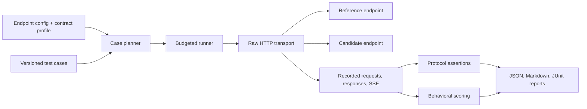

# DeepSeek Provider Verifier — proposed design

Date: 2026-09-21. Status: design proposal, ready for review. The user has created the private repository; implementation has not started.

## 1. Name and purpose

Confirmed repository: **[smg-project/deepseek-provider-verifier](https://github.com/smg-project/deepseek-provider-verifier)**. It is private, uses `main`, and currently contains an MIT `LICENSE` at initial commit `5c8154da3d7d1a6accc575785f186907b2e61254`. Preserve the selected license and visibility.

Display name: **DeepSeek Provider Verifier**. Proposed Python import: `deepseek_provider_verifier`. Proposed CLI: `dpv`. Distribution name: `deepseek-provider-verifier`, subject to a package-registry availability check before publishing.

Suggested description: “Verify DeepSeek API compatibility and deployment quality across providers, inference engines, and gateways.”

Use an explicit README attribution: “A community project maintained by smg-project. Not affiliated with or endorsed by DeepSeek.”

The proposed scope is DeepSeek first, with a reusable execution core. Repository ownership does not require SMG in the execution path: the verifier must work against any configured HTTP endpoint.

### Approaches considered

| Approach | Benefit | Cost | Recommendation |
| --- | --- | --- | --- |
| DeepSeek-specific suite with reusable execution and reporting | Clear purpose; model-specific tests can be accurate; easiest first release to evaluate | Additional model families would need new profiles and possibly broader branding | Adopt |
| General `llm-provider-verifier` from day one | Name accommodates Kimi, MiniMax, DeepSeek, and future models | More profiles, baselines, and maintenance before a useful first release | Choose only if multiple families are a launch requirement |
| Fork a Kimi/MiniMax verifier and replace model names | Fast initial runner reuse | Their datasets, expectations, and thresholds need substantial revalidation for DeepSeek | Reuse small attributed components only after license and semantic review |

`deepseek-provider-verifier` is more discoverable than `smg-verifier`; “provider” includes hosted services, direct inference engines, and gateways. The user selected this name by creating the repository during planning.

## 2. Questions the project answers

1. Does this endpoint satisfy a specified, dated DeepSeek API contract?
2. Do required features actually behave correctly, including streaming and tool conversations?
3. Does the deployment retain task quality relative to an identified reference deployment under matched settings?
4. What latency and availability did the same test workload observe?
5. When both routes are available, which failures appear only through the gateway?

A passing report establishes evidence for the tested behavior. It does not authenticate weights, identify quantization conclusively, certify a vendor, or establish performance under untested production load.

## 3. Release scope

### v0.1

- Chat Completions and Responses, each with streaming and non-streaming coverage.
- Explicit thinking-on and thinking-off cases where supported by the selected model profile.
- Function calls, JSON arguments, multi-turn tool result replay, reasoning-history handling, output formats, usage accounting, and bounded negative tests.
- Deterministic local mock tools. The verifier never executes arbitrary model-generated commands.
- Official-reference and candidate runs using the same case manifest.
- Capability and API-contract reports, repeated behavioral measurements, JSON/JSONL evidence, Markdown summaries, and JUnit output.
- Sequential baseline/candidate execution by default, with a paired interleaving option to reduce time drift when independent endpoints permit it.
- Offline tests on every pull request; manually triggered live validation with explicitly configured endpoints.

### Later releases

- Vision, long context, beta strict tools, and prefix completion as separately budgeted packs.
- `apply_patch` behavior against a temporary fixture filesystem; no real repository edits.
- SMG-specific stateful Responses and gateway extensions under a separate contract.
- External quality benchmarks such as DeepSWE through adapters, retaining their licenses, harness versions, and scoring.
- Optional HTML reports and published result submissions with reproducible evidence.
- Additional model-family profiles after the DeepSeek interfaces stabilize.

The first release includes observed latency metrics, not a load-testing framework, public leaderboard, hosted service, or dashboard application.

## 4. Contract profiles and source policy

Every run selects an immutable profile, initially named `deepseek-api-2026-09-21`. The profile declares protocol, model applicability, thinking mode, feature expectations, source URL, source section, retrieval date, source hash when captured, and evidence status. Model aliases and release identities are recorded separately from the API-contract date.

Each feature has one of `supported`, `ignored`, `unsupported`, or `unknown`, plus its request conditions and observable assertion. A successful HTTP response alone cannot upgrade a feature from accepted to behaviorally verified.

Maintain three evidence labels:

- `documented`: supported by a captured official reference or guide.
- `observed`: measured against a named endpoint at a recorded time.
- `project-policy`: an acceptance rule chosen by this project or a deployment owner.

Documentation and baseline behavior can disagree. Report `SPEC_CONFLICT`; do not silently rewrite the expectation. A disputed assertion remains diagnostic until maintainers resolve it in a new profile revision. A run requiring that unresolved feature is inconclusive. Observations cannot prove an undocumented capability is an official contract.

An SMG deployment may intentionally expose functionality beyond DeepSeek's native API. Evaluate its shared capabilities and extension contract separately. Strict official-fidelity tests can record a difference, while the report identifies the declared extension instead of attributing it to model corruption. SMG documents gateway-managed chat history and multiple API surfaces. [SMG README](https://github.com/smg-project/smg)

### Concrete source-driven distinctions

- Chat Completions uses data-only SSE and a `[DONE]` terminator. Its documented usage placement and `tool_choice` restrictions depend on the selected mode. Treat these as Chat-specific assertions. [Chat reference](https://api-docs.deepseek.com/api/create-chat-completion/)
- Responses uses typed events and a terminal response event. Its reference defines item IDs, tool-call pairing, and separate reasoning and output items. [Responses reference](https://api-docs.deepseek.com/api/create-response/)
- DeepSeek's Responses guide describes a stateless service, ignored options, and always-enabled parallel tool calling. Do not import every OpenAI capability as a DeepSeek requirement. [Responses guide](https://api-docs.deepseek.com/guides/responses_api/)
- The thinking guide requires reasoning history to be retained for requests carrying tools. Include successful replay and an intentionally incomplete-history counterpart. [Thinking guide](https://api-docs.deepseek.com/guides/thinking_mode/)

Research limitation: the Chat reference was available through official-site search extraction during planning, while direct retrieval repeatedly timed out. Before promoting its detailed rules to a release gate, capture a reviewable reference snapshot and calibrate the disputed/conditional cases against an official endpoint. No live endpoint calls have been performed for this proposal.

## 5. Architecture



Proposed stack: Python 3.11+, `uv`, `httpx`, `pydantic`, `jsonschema`, `pytest`, and `ruff`. Use standard-library `argparse`, `tomllib`, and XML output initially. Resolve and commit a dependency lock during implementation. HTTPX provides asynchronous requests and streaming; pytest parametrization suits the case matrix. [HTTPX](https://www.python-httpx.org/async/), [pytest](https://docs.pytest.org/en/stable/how-to/parametrize.html)

Use raw HTTP for core conformance testing so a client SDK cannot normalize malformed responses, alter retry accounting, or hide unknown fields. A later SDK smoke pack measures application compatibility independently.

| Unit | Responsibility | Boundary |
| --- | --- | --- |
| Config/profile loader | Validate endpoints, profile versions, requirements, budgets | Never sends requests |
| Planner | Expand cases into an immutable manifest; calculate request/token ceilings | Never infers support by dropping failures |
| HTTP transport | Send exact payloads and capture status, headers, bytes, timing | No model-specific repair or fallback |
| SSE decoder | Incremental UTF-8 and SSE framing | Retains source event data; no protocol semantics |
| Protocol adapters | Build protocol-specific payloads; assemble streamed outputs | Preserve raw evidence alongside normalized views |
| Assertions | Check API contract, tool arguments, and local fixture results | No network or arbitrary tool execution |
| Runner | Schedule cases and conversation steps within budgets | Every attempt and interruption is visible |
| Comparison | Match reference and candidate evidence and assess uncertainty | Reject incompatible run manifests |
| Reporters | Render consistent views of the same result model | No independent re-scoring in templates |

Configuration permits endpoint-specific model strings and explicit extra fields. Any request difference is included in a comparison manifest. The default comparison rejects behavioral changes beyond endpoint/model addressing; approved provider-specific equivalents require a named mapping and are shown in the report.

## 6. Initial case catalog

These are 24 case templates, not 24 HTTP requests. The planner expands protocol/mode/stream variants and accounts for multi-step conversations before execution.

| ID | Case | Primary oracle |
| --- | --- | --- |
| C01 | Simple text request | Required fields, terminal response, valid content types |
| C02 | Explicit thinking disabled | Protocol-correct output without leaked reasoning markers |
| C03 | Thinking enabled | Separate channels when reasoning is emitted; no requirement for a particular chain of thought |
| C04 | Two user turns with full history | Local synthetic fact recalled; scored as behavior |
| C05 | JSON object output | Parse completed output; truncation receives a distinct result |
| C06 | Schema-constrained output | Validate declared schema only where profile supports it |
| C07 | Tool use disallowed | No generated tool calls under the supported condition |
| C08 | Required tool use | Valid tool call or documented rejection in the selected mode |
| C09 | Named tool selection | Correct name or documented rejection in the selected mode |
| C10 | Automatic tool selection | Trigger agreement and task success across repeated prompts |
| C11 | Nested function arguments | Parse JSON, validate schema, verify fixture-specific values |
| C12 | Multiple tool calls | Preserve distinct call IDs and reconstruct each argument stream |
| C13 | Tool result continuation | Local tool result changes the model's final answer correctly |
| C14 | Thinking plus tool continuation | Preserve complete returned assistant history during replay |
| C15 | Incomplete reasoning history | Documented negative behavior, calibrated before gating |
| C16 | Interleaved streamed tool arguments | Assemble by call/item identity without loss or cross-talk |
| C17 | Stream lifecycle and termination | Protocol-specific terminal conditions; incomplete transport cannot pass |
| C18 | Stream/non-stream semantic consistency | Same fixture oracle across modes, not identical prose |
| C19 | Small output limit | Correct terminal/truncation reporting; no demand that every response hit the limit |
| C20 | Usage accounting | Nonnegative counts and profile-specific arithmetic; no inferred weight identity |
| C21 | Invalid request shape | Documented status class without overfitting error-message wording |
| C22 | Invalid tool result pairing | Profile-supported pairing validation |
| C23 | Responses stateless conversation | Successful full-history replay and reported storage semantics |
| C24 | Accepted/ignored option probes | Report documented handling; distinguish acceptance from demonstrated effect |

Offline fault cases additionally exercise fragmented UTF-8, split SSE delimiters, keepalive comments, CRLF, malformed JSON, premature EOF, reordered identity events, duplicate terminal events, HTTP errors, timeouts, cancellation, and interrupted result writing. Stream assembly invariants are checked within one response; independent live generations are never expected to match byte-for-byte.

Behavior cases use original synthetic prompts and deterministic mock tool responses, including tool-required, tool-forbidden, and genuinely ambiguous examples. Prompts and expected answers are versioned separately. Explicitly authored variations reduce overreliance on one wording; no claim of adversarial fingerprinting is made.

## 7. Results, scoring, and failure handling

Case outcomes: `PASS`, `FAIL`, `ERROR`, `SKIP`, `INCONCLUSIVE`.

- `FAIL`: evidence demonstrates a violated required assertion.
- `ERROR`: a transport or runner problem prevents evaluation; never counted as success.
- `SKIP`: the case is outside the predeclared scope; retain its reason and denominator.
- `INCONCLUSIVE`: evidence is insufficient or conflicting.
- A required endpoint feature returning unsupported behavior fails its requirement. Auto-discovery cannot turn it into a skip.

Report three separate sections: API contract results, task-quality comparison, and availability/latency. Avoid a combined score that allows speed to compensate for broken tool calls.

Required deterministic assertions must all pass for a contract PASS. Behavioral scores include task success, tool-trigger precision/recall/F1, and conditional schema validity, with denominator counts. End-to-end success uses all planned attempts; availability failures remain visible even when a conditional quality metric excludes responses that could not be scored.

Retries default to zero. If enabled, show both first-attempt and eventual success, bill/count all attempts, and never retry malformed successful responses into a hidden pass. A transient infrastructure failure leaves verification incomplete unless the user-defined policy explicitly permits it. Reports retain original and retry records.

No universal “98% passes” rule is assumed. The first release reports repeated measurements and uncertainty. An optional quality gate requires an explicit per-metric non-inferiority margin, minimum independent case coverage, repetition policy, and confidence level. Bootstrap differences by prompt cluster when prompts have repeated samples. With too little evidence, return INCONCLUSIVE. Do not present a high p-value as equivalence.

Comparisons require matching dataset/profile versions, intended model release, reasoning mode, output budget, applicable options, and scorer revision. Different provider model labels are allowed through an explicit mapping. Unknown checkpoint identity permits a clearly labeled exploratory report, not a quality-equivalence verdict. Mutable reference aliases are timestamped and remeasured with candidates; a previous baseline is never silently reused.

Latency includes time to response headers, first SSE event, first meaningful output (text/reasoning/tool, explicitly labeled), and completion. Token throughput uses reported usage with its limitations; do not infer token speed by counting chunks. Default runs are low-concurrency diagnostics, not SLA certifications.

## 8. Execution, budgets, and evidence

`dpv plan` performs no network calls and emits the expanded case manifest, missing prerequisites, request ceilings, per-request generation limits, aggregate generation-token ceiling, concurrency, and timeout limits. Default smoke runs have at most 40 outbound attempts per endpoint, at most 4 requests per conversation, concurrency 1, and a 300-second case deadline. Output-token ceilings are explicit in the selected preset: 512 for non-thinking smoke and 4096 for thinking smoke. Budget exhaustion is reported as incomplete, never a passing subset.

These are proposed project defaults, not guaranteed runtime or cost estimates. Reference and candidate calls each consume the run-wide budget. A monetary estimate is available only if a user supplies pricing; it includes input/reasoning/output where applicable and is labeled an estimate.

The default smoke preset is explicitly bounded. For each selected protocol it includes C01 (non-thinking, both stream settings), C03 (thinking, both), C05 (non-thinking, non-streaming), C07 and C11 (non-thinking, both), C13 (non-thinking, both, maximum two requests each), and C14 (thinking, non-streaming, maximum four requests). C02, C17, and C20 are additional assertions on those existing attempts, with no extra requests. This is at most 17 requests per protocol or 34 per endpoint for both protocols, below the 40-attempt cap. The full C01–C24 matrix requires an explicitly expanded budget and separate planning. Required features outside the selected subset are not implied to have passed.

Save `manifest.json`, `attempts.jsonl`, `results.jsonl`, `summary.json`, `summary.md`, and `junit.xml`. Each result links a stable case ID to evidence, assertion ID, source rule, endpoint label, and timings. Local raw request bodies/responses/SSE are optional artifacts; redaction removes authorization, cookies, secret config values, and secret-bearing URL components before persistence. Streaming tokens used for conversation replay remain available in memory even when omitted from persisted reports. Nothing is uploaded automatically.

Resume only when manifest and artifact hashes match. A completed result is not repeated silently; a truncated/incomplete record is detected and rerun as a new attempt with its prior state retained. Once credentials are resolved, they do not enter the manifest or hashes used in reports.

Proposed exit statuses: `0` = all selected required gates completed and passed; `1` = completed verification with required failures; `2` = invalid setup, interruption, required execution errors, or insufficient evidence. Incomplete runs take precedence over status 1, while still displaying any known failures. Report-only quality comparisons do not prevent an API-contract result, and the report states which gates were enabled.

## 9. Proposed configuration and CLI

```toml
[run]
profile = "deepseek-api-2026-09-21"
suite = "smoke"
protocols = ["chat", "responses"]
concurrency = 1
max_attempts_per_endpoint = 40
retries = 0

[endpoints.reference]
base_url = "https://api.deepseek.com"
api_key_env = "DEEPSEEK_API_KEY"
model = "deepseek-flash"
model_release = "unknown" # Replace with a verified release before quality gating.

[endpoints.candidate]
base_url = "http://localhost:30000/v1"
api_key_env = "CANDIDATE_API_KEY"
model = "your-deployed-model-id"
model_release = "unknown"
```

The `model_release` field is operator-supplied evidence metadata, not an authentication mechanism. Self-hosted endpoints may explicitly opt out of authentication. `base_url` is the API root and is joined with `chat/completions` or `responses` exactly once; there is no endpoint-path guessing.

```sh
dpv plan --config providers.toml
dpv run --config providers.toml --endpoint candidate --out runs/candidate
dpv run --config providers.toml --endpoint reference --out runs/reference
dpv compare runs/reference runs/candidate --out runs/comparison
dpv report runs/comparison --format markdown
```

These commands describe the proposed interface; they are not installed or implemented yet.

## 10. Delivery and acceptance

1. Freeze profile rules and implement the manifest planner with zero network activity.
2. Implement raw transport, SSE framing, and protocol assembly against deliberately faulty local servers.
3. Add the 24 case templates and bounded multi-turn runner; first useful candidate report.
4. Add reproducible reference comparison and evidence-aware statistical reporting.
5. Complete CLI/reporting and offline CI; calibrate selected gates with live reference/candidate runs.
6. Publish v0.1 with documented capability coverage and a reproducible sample report.

Release acceptance requires that the suite catches seeded defects: lost reasoning history, mixed tool-call deltas, truncated streams, malformed arguments, ignored required-tool behavior, wrong usage arithmetic, and swallowed failures. A passing mock implementation alone is insufficient: both correct fixtures and targeted faulty fixtures must be tested. Public release evidence identifies exactly which live protocol/model combinations were exercised.

The repository already uses MIT; preserve it for original code. Preserve notices and separately inspect code/dataset licenses for any imported Kimi/MiniMax components. No copied evaluation corpus is assumed by this design.

## 11. References

- [Kimi Vendor Verifier](https://github.com/MoonshotAI/Kimi-Vendor-Verifier): model-specific evaluation and feature-check inspiration.
- [MiniMax Provider Verifier](https://github.com/MiniMax-AI/MiniMax-Provider-Verifier): provider comparison and tool-call metric inspiration.
- [DeepSeek Chat reference](https://api-docs.deepseek.com/api/create-chat-completion/).
- [DeepSeek Responses reference](https://api-docs.deepseek.com/api/create-response/).
- [DeepSeek Responses compatibility guide](https://api-docs.deepseek.com/guides/responses_api/).
- [DeepSeek thinking guide](https://api-docs.deepseek.com/guides/thinking_mode/).
- [SMG](https://github.com/smg-project/smg).

All release scope, file layout, test counts, defaults, CLI names, and acceptance policies in this document are proposals by this project, not statements of endorsement or requirements published by DeepSeek.
